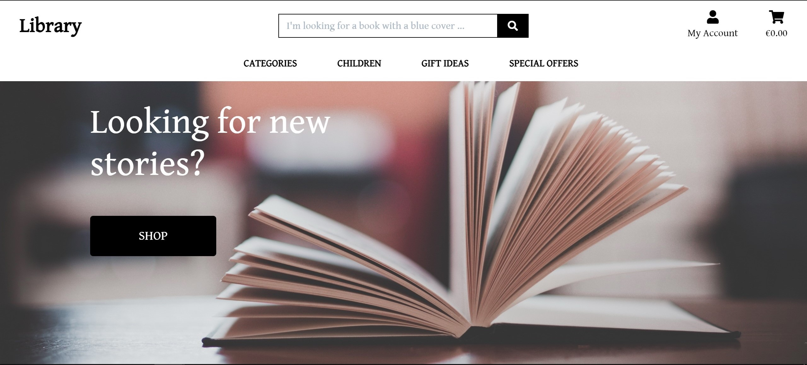
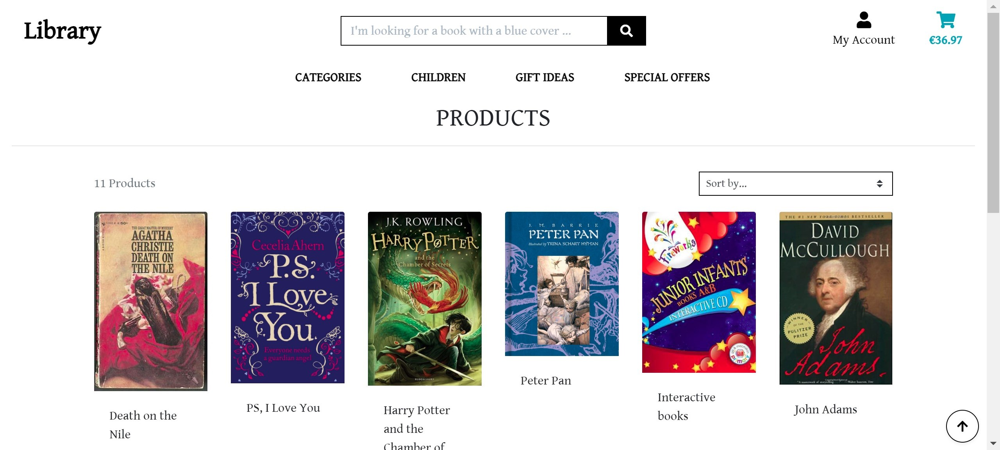
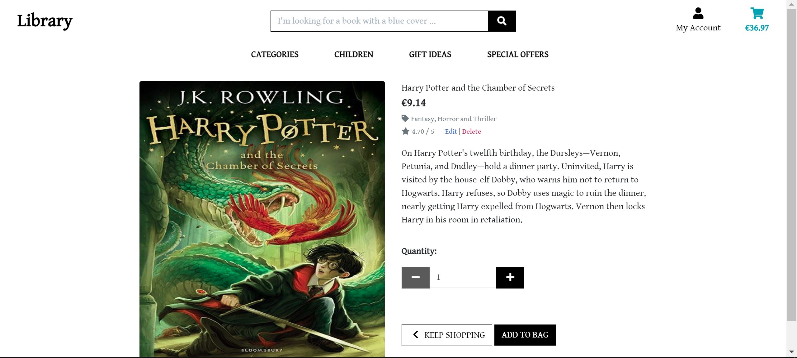
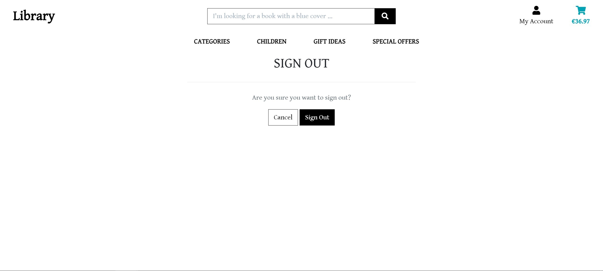

# Library

My Website has been developed for Code Institute's Full-Stack Frameworks with Django Milestone Project and represents e-commerce. It is an a minimalist and essential site for sale books suitable for small bookshops who want to have an online window!

 Visit the Website: 
 

[Library](https://salvo-library.herokuapp.com/)

## UX

### Project Purpose

The goal of Library is to give the user a good experience when purchasing book(s) in a simple & effective way using the following functions:

- User registration form
- User log in control
- Log out
- Recover forgotten password
- Viewing profile Information page
- Viewing purchase history
- Edit delivery address
- Easy navigation
- Search quickly using the search bar
- Viewing name, cover, description, price, rating of book(s)
- Sort/order the catalog of book(s) by:
    - price low to high/high to low;
    - rating low to high/high to low;
    - name low to high/high to low;
    - categories low to high/high to low; 
- View the existing categories
- Adding book(s) to the cart
- Adjusting the quantity of book(s) in cart
- Removing book(s) from cart
- Secure online payment

From the perspective of the website vendor or operator, Library's goal is to offer a good experience when updating the website in a simple and effective way by using user functions in addition to the following:

- Log as Admin/Superuser
- Add, modify or delete item(s)/book(s):
    - Category;
    - Name;
    - Description;
    - Price;
    - Rating;
    - Image by url or loading;
- Add, modify or delete categories
- Add, modify or delete an order
- Authenticate user log in, emails

### User Experience

- Users are presented with a simple user interface that uses buttons and drop-down menus for easy navigation at the top of
the screen for viewing mobile and tablet devices and a navigation list on the side of the desktop display for a home / Library, a log, services, products, shopping cart, access and review depending on the user's login status.

- At the top of the page there is always the navigation bar to prevent a user of a device from being forced to go back or scroll to the menu to navigate.

- All the books on the product page have a title, price, category, rating. As Admin / Superuser there are also two buttons for edit and delete.

- Clicking on the cover of the books opens the details page. the presentation page divided into two quadrants, on the left the cover image, on the right the name, the price, the category to which it belongs, rating, a short description, a button to change the quantities, a button to return to the page precedenete, a button to add to cart. also here as Admin / Superuser there are also two buttons for edit and delete.

- When the user adds, modifies, removes or performs a login, log out, purchase action, a notification is displayed with a toast. the displayed message is fixed under the cart and modified with colors according to the type of message displayed.

- The layout remains the same to try to keep things simple and hassle-free when navigating from page to page, which prevents the user from clicking the browser's back button.

- The login or registration forms will not be displayed to the incoming user to maintain navigation even for users who wish to purchase without registering or logging in.

- The layout of a white background has been included on the product and service pages to keep the layout clean and speed up loading times if there are many products or services to display on a device. the only background image is shown on the home screen as a stylistic and aesthetic presentation to the website.

- Login and registration have been implemented on the website to help protect user data such as confidential information and Stripe takes care of card payments.

### User Stories:

- As an entrepreneur, I want to have a way to easily manage my e-commerce. I want to be able to have a site where I can sell in to a public online with speed and simplicity.

- As a website owner and sole trader, I want my website to be efficient, intuitive and suitable for everyone. I need an easy way to increase my sales and find a growing audience of buyers.

- As a seller as a profession I need to expand my showcase and not to be beaten by the competition.

- As a Library user I can manage my account and buy books and keep up to date with upcoming news or to find something to read as a hobby.

- As a Library user I can easily browse and navigate the website and find the best offers and gifts or what I am passionate about.

- As a website user, payments are secure and I don't have to worry about my password or card details being stolen. Immediate deliveries and an always updated catalog.

### Design ideas

Website design is all about trying to provide a simple yet straightforward layout without over-complication or the feel of too many things.

- #### Characters

    - The standard font was used to keep things simple.

- #### Colors

    <b> black / white </b>
    These colors were used for most of the pages on the website, including the text, navigation, and button elements.
     

   
    <b> white </b>
    This color was used for a background color. except on the home page
     
    
- #### Styling
    
    ** Special styles include: **
    
    - ** Buttons - ** The buttons were designed using bootstrap and the colors were chosen using the bootstrap color scheme. I used Font Awesome to add icons to buttons to help users better understand the purpose at a glance.
        
    
    - ** Pagination - ** Pagination consists of a navigation menu at the top.

### Wireframe

The wireframes have not been created but by copying an already existing project and modifying it as needed.

- #### Wireframe

    - Home
    
    - Products Page
    
    - Details Books Page
    
    - [Login page](https://salvo-library.herokuapp.com/accounts/login/)
    - 
    - [Registration page](https://salvo-library.herokuapp.com/accounts/signup/)
    - 
    - [Cart Page](https://salvo-library.herokuapp.com/bag/)
    - 
    - [Payment form](https://salvo-library.herokuapp.com/checkout/)
    - 
    - [Profile page](https://salvo-library.herokuapp.com/profile/)
    - 
    - [Bag page](https://salvo-library.herokuapp.com/bag/)
    - 
    - Log out Page
    

### Developer and commercial purpose

- Must show clear and professional examples of HTML, CSS, JavaScript and Python.

- Must show the use of Django's knowledge.

## Features

In this section, you should go over the different parts of your project, and describe each in a sentence or so.
 
### Existing Features
- Feature 1 - allows users X to achieve Y, by having them fill out Z
- ...

For some/all of your features, you may choose to reference the specific project files that implement them, although this is entirely optional.

In addition, you may also use this section to discuss plans for additional features to be implemented in the future:

### Features Left to Implement
- Another feature idea

## Technologies Used

In this section, you should mention all of the languages, frameworks, libraries, and any other tools that you have used to construct this project. For each, provide its name, a link to its official site and a short sentence of why it was used.

- [JQuery](https://jquery.com)
    - The project uses **JQuery** to simplify DOM manipulation.

## Testing

In this section, you need to convince the assessor that you have conducted enough testing to legitimately believe that the site works well. Essentially, in this part you will want to go over all of your user stories from the UX section and ensure that they all work as intended, with the project providing an easy and straightforward way for the users to achieve their goals.

Whenever it is feasible, prefer to automate your tests, and if you've done so, provide a brief explanation of your approach, link to the test file(s) and explain how to run them.

For any scenarios that have not been automated, test the user stories manually and provide as much detail as is relevant. A particularly useful form for describing your testing process is via scenarios, such as:

1. Contact form:
    1. Go to the "Contact Us" page
    2. Try to submit the empty form and verify that an error message about the required fields appears
    3. Try to submit the form with an invalid email address and verify that a relevant error message appears
    4. Try to submit the form with all inputs valid and verify that a success message appears.

In addition, you should mention in this section how your project looks and works on different browsers and screen sizes.

You should also mention in this section any interesting bugs or problems you discovered during your testing, even if you haven't addressed them yet.

If this section grows too long, you may want to split it off into a separate file and link to it from here.

## Deployment

This section should describe the process you went through to deploy the project to a hosting platform (e.g. GitHub Pages or Heroku).

In particular, you should provide all details of the differences between the deployed version and the development version, if any, including:
- Different values for environment variables (Heroku Config Vars)?
- Different configuration files?
- Separate git branch?

In addition, if it is not obvious, you should also describe how to run your code locally.

## Credits

### Content
- The text for section Y was copied from the [Wikipedia article Z](https://en.wikipedia.org/wiki/Z)

### Media
- The photos used in this site were obtained from ...

### Acknowledgements

- I received inspiration for this project from X
